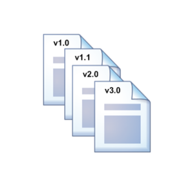
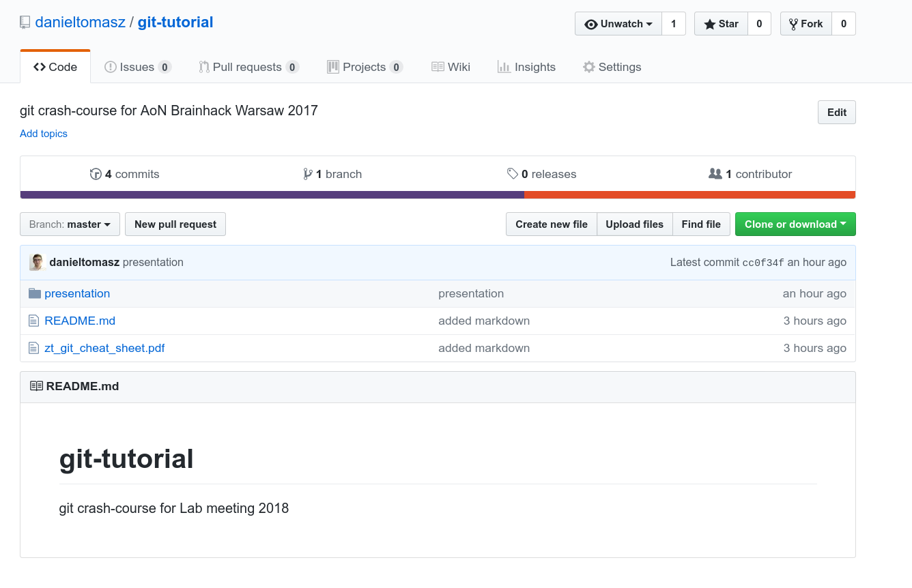
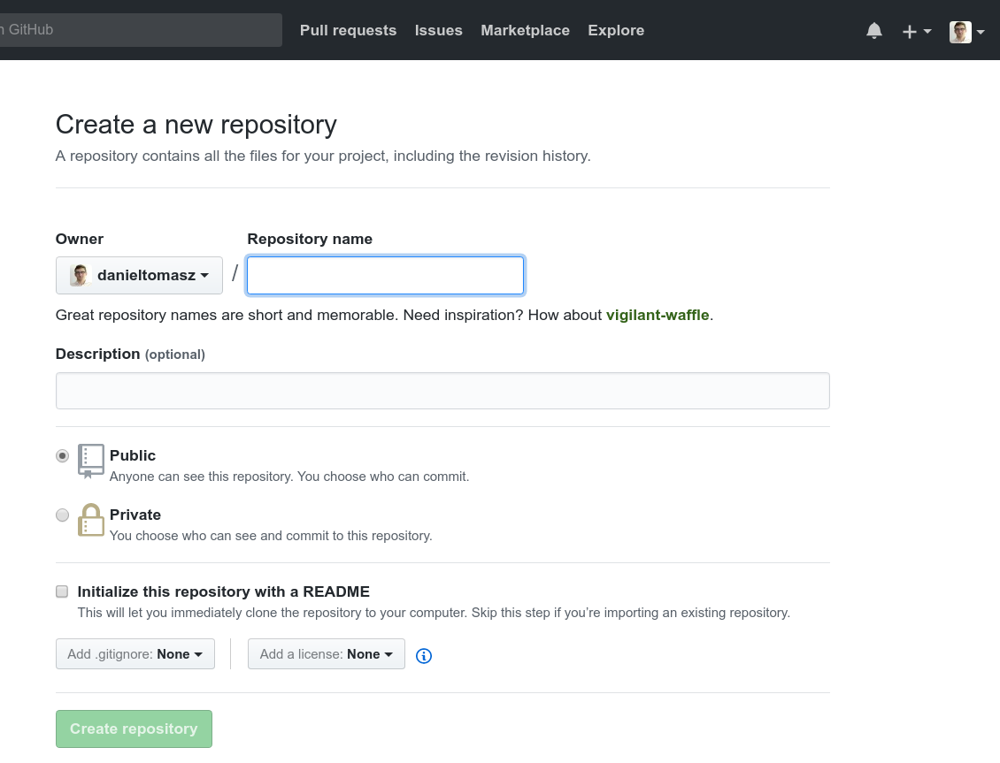

name: inverse
layout: true
class: center, middle, inverse
---

#Git & Github collaboration tutorial
lab meeting 18.01.2018 @ Ghent

---
layout: false
.left-column[
## git & github 101

## moar about collaboration ]

.right-column[
**Git**   is a program, allows groups of people to work on the same documents at the same time, and without stepping on each other's toes.”

**GitHub** is an online service

- hosts your repositories (projects)
- helps you work with contributors/collaborators
- web interface for version control
- synchronise among several computers
- contribite to open source projects
]

---
layout: false
.left-column[
## 'git'?]

The readme file of the source code:

The name "git" was given by Linus Torvalds when he wrote the very first version. He described the tool as "the stupid content tracker" and the name as (depending on your way):

 - random three-letter combination that is pronounceable, and not actually used by any common UNIX command. .
 - (british slang)  **git** - a foolish of  worthless person
 - "global information tracker": you're in a good mood
 - "goddamn idiotic truckload of shit": when it breaks

Git stores a  **snaphot** of what all the files in your project looks like every time you commit
---
layout: false
.left-column[
## Version control]

Management of **changes**, called **revisions** to any types of information

- Simple file versioning (a v1.0, v1.1,to filenames)

    

- Simple tools: Google Drive, Dropbox...
- Advanced tools: subversion, mercurial  and git

**Revision:** Change associated with a **timestamp** and the **person** making the change

---

layout: false
.left-column[
## Version control]

**Benefits:**

- Go back to previous versions
- Store history of changes
- Collaborate with others
- When you are academic, you could get private repo for free https://education.github.com/pack

**Interfaces to GitHub**

- **directly online**
- **with the Github Desktop App**
- via the command line using ‘git’

**Installing git locally**
- command line git already installed on ubuntu or try
	`sudo  apt-get install git`
- many graphical interfaces guis, there is [github desktop](https://github.com/shiftkey/desktop)
 unoficial fork for linux, also  you could use [gitkraken](https://www.gitkraken.com/) and get [free pro version for one year for academics](https://www.gitkraken.com/github-student-developer-pack)

---
layout: false
.left-column[
## Git workflow
## Cloning repo]
.right-column[

### Excercise 1. Fork to your account and then clone  this repo

    `git clone https://github.com/danieltomasz/git-tutorial.git`

After that you need to change folder (in unix  `cd`  command). Now you have exact copy of repository on your local computer.
Feel free to  `clone`  repos,  you cannot break it on GitHub since you do not have `push` rights.
- ]
---
layout: false
.left-column[
## Git workflow
## Creating repo locally]

.right-column[
In case you have local project files on your computer you need to create repository locally. `cd` to root folder od your project and initialize repository:

    `git init`

  Executing this  will create a new `.git` subdirectory in your current working directory. This will also create a new master branch.

    `git add .`

your repo will now have  all files from folder added to the history and will track future updates to the file.
You could exclude some files  and folders by putting them in special  `.gitignore` file  that is checked in at the root of your repository.]

---
layout: false
.left-column[
## Git workflow
## Creating repo locally]

.right-column[
Now time for creating remote repository (on github).

Connect your local  to remote repo

    `git remote add origin https://github.com/user/repo.git`

in my case it was `git remote add origin https://github.com/danieltomasz/git-tutorial.git`. After that  check   `git remote -v`, in case you do mistake use `git remote rm origin`,
]

---
layout: false
.left-column[
## Git workflow
##Pushing changes]

.right-column[
### Excercise 1. Create in your local  repository inside `dummy folder`  file name  after  you.
Add  your changes by     `git add .` Now commit your changes

`git commit -m "first commit to the repo"``

Now push your  local changes (we are now on master branch)

`git push origin master`

When working with more people the issue  become  more complicated. ]

---
layout: false
.left-column[
## Git workflow]
.right-column[

]
`git push origin master`

# Github terms

**Repository (Repo)**
is a virtual storage of your project. It allows you to save versions of your code, which you can access when needed.

**Commit**
saving a version of file(s)
**> git add README.md**
**> git commit -m ‘My first commit’**

**Issues**
to-do list of tasks, bugs and things you wish to accomplish

**Branch**
When working with a centralized workflow the concepts are simple, `master` represented the official history. With each now scope of work, aka feature, the developer is to create a new branch.

**Pull request**
request to add your changes from a branch back into master ****
**Merge**
act of incorporating new changes (commits) from one branch to another
**Fork**
make a copy of someone else repository. A fork isn't a Git concept really, it's more a political/social idea.

**Clone**
copy a repository onto your local computer
**Download Zip**
download the content of a repository

# Collaborating with GitHub
# Add collaborators

As the **owner** of a repo you:

    1. **add** people as **collaborators**
    2. each collaborator can read/write files in the repo
    3. each collaborator is adding files and other content → making branches → and either directly merging changes in or via pull requests
# Fork + Pull Request

If you don’t own a repo and aren’t an official collaborator:

  1. you will **fork a repo**
  2. work on your forked copy of the repo
  3. in order to get your changes pulled into the original repo → **make a pull request** for the changes you’ve made
  4. the author/owner of the original repo will determine if your changes are cool → and merge them in.
  5. Make friends + Big party!

## Installing git

[https://gist.github.com/derhuerst/1b15ff4652a867391f03](https://gist.github.com/derhuerst/1b15ff4652a867391f03)

    git push origin remote  

    Keeping a fork up to date

    Raw
    ### 1. Clone your fork:

        git clone git@github.com:YOUR-USERNAME/YOUR-FORKED-REPO.git

    ### 2. Add remote from original repository in your forked repository:

        cd into/cloned/fork-repo
        git remote add upstream git://github.com/ORIGINAL-DEV-USERNAME/REPO-YOU-FORKED-FROM.git
        git fetch upstream

    ### 3. Updating your fork from original repo to keep up with their changes:

        git pull upstream master

check remote

    git remote show origin
    git remote -v
    git remote set-url origin https://github.com/USERNAME/REPOSITORY.git

make a new branch  with clear commit history

    git branch fcbrainhack $(echo "commit message" | git commit-tree HEAD^{tree})

# More advanced stuff

**rebase first, then merge**.

- https://dev.to/maxwell_dev/the-git-rebase-introduction-i-wish-id-had
- git branches [https://railsware.com/blog/2014/08/11/git-housekeeping-tutorial-clean-up-outdated-branches-in-local-and-remote-repositories/](https://railsware.com/blog/2014/08/11/git-housekeeping-tutorial-clean-up-outdated-branches-in-local-and-remote-repositories/)
- https://github.com/mockito/mockito/wiki/Using-git-to-prepare-your-PR-to-have-a-clean-history

#cheatsheet

https://gist.github.com/hofmannsven/6814451

[https://gist.github.com/hofmannsven/6814451](https://gist.github.com/hofmannsven/6814451)
https://sethrobertson.github.io/GitFixUm/fixup.html
